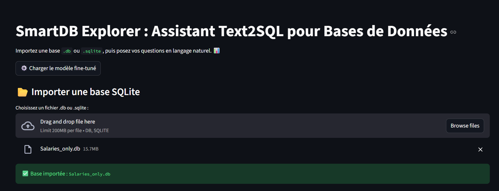
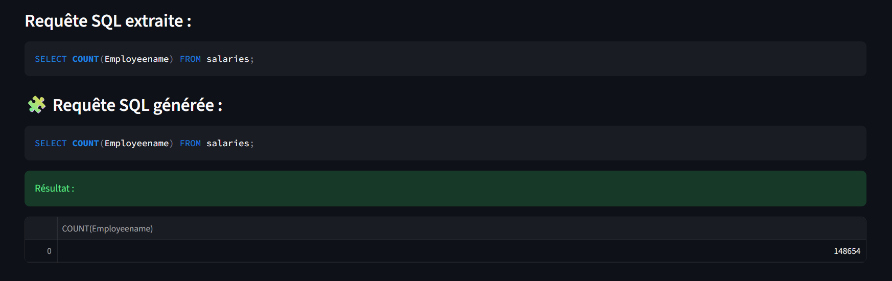

# 🧠 SmartDB Explorer — Text2SQL Assistant for Databases



> Fine-tuned open-source Text-to-SQL model that converts natural language questions into valid **SQLite SQL queries** — and executes them directly in a database.  
> Built with 🤗 Transformers, LoRA fine-tuning, and Streamlit.

---

## 🚀 Overview

**SmartDB Explorer** is an intelligent assistant that lets you:
- Upload any `.db` / `.sqlite` database
- Ask questions in natural language (English or French)
- Automatically generate optimized **SQLite queries**
- Execute them safely and view results instantly  

It is powered by a fine-tuned version of **`NumbersStation/nsql-350M`** on the **`motherduckdb/duckdb-text2sql-25k`** dataset.

---

## 🧩 Example



> **Question:**  
> _"How many employees are in this table?"_

✅ **Generated SQL:**
```sql
SELECT COUNT(EmployeeName) FROM Salaries;
✅ Result:
148,654 employees
